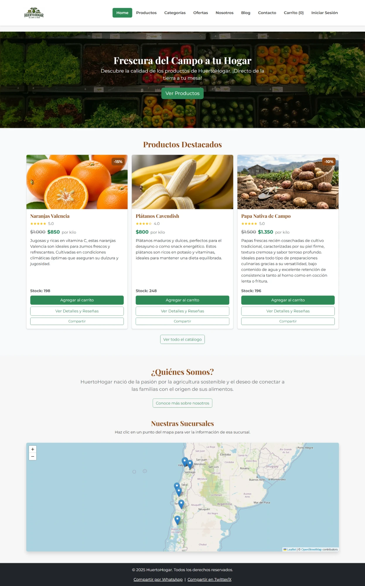
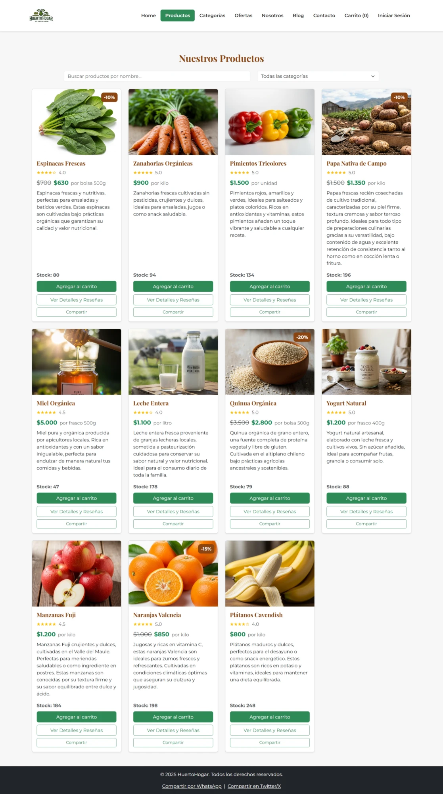
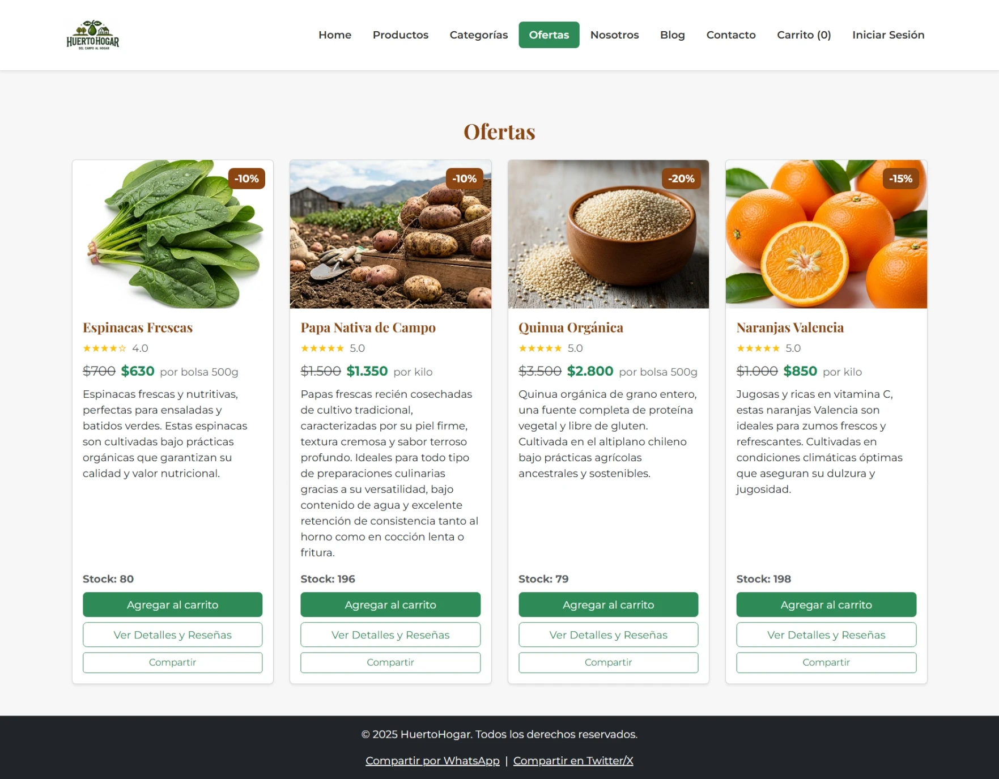
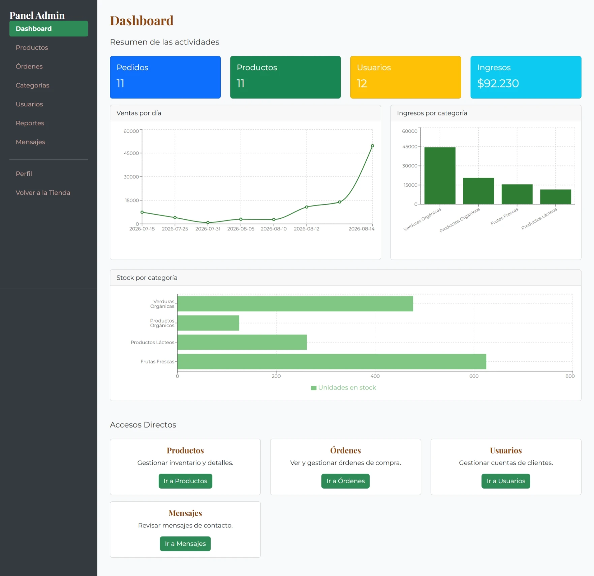

<p align="center">
  
</p>

<h1 align="center">HuertoHogar</h1>

<p align="center">
  Tienda online de productos frescos del campo — API REST en Spring Boot y SPA en React que la consume.
</p>

<p align="center">
  
  
  
  
  
  
</p>

<p align="center">
  <a href="https://github.com/Cristofer-SanMartin-Dev/Huertos-Hogar/actions/workflows/backend-ci.yml"></a>
  <a href="https://github.com/Cristofer-SanMartin-Dev/Huertos-Hogar/actions/workflows/frontend-ci.yml"></a>
</p>

**Demo en vivo:** [huertos-hogar.vercel.app](https://huertos-hogar.vercel.app) — API en [huertohogar-backend.onrender.com](https://huertohogar-backend.onrender.com/swagger-ui/index.html)

> El backend está en el plan free de Render: si nadie lo usó en los últimos 15 minutos, la primera carga puede tardar ~50 segundos en "despertar".

## Tabla de contenidos

- [Sobre el proyecto](#sobre-el-proyecto)
- [Capturas](#capturas)
- [Funcionalidades](#funcionalidades)
- [Arquitectura](#arquitectura)
- [Stack tecnológico](#stack-tecnológico)
- [Cómo levantar el proyecto](#cómo-levantar-el-proyecto)
- [Tests](#tests)
- [Roles y permisos](#roles-y-permisos)
- [Estructura del repositorio](#estructura-del-repositorio)
- [Documentación de cada módulo](#documentación-de-cada-módulo)
- [Licencia](#licencia)

## Sobre el proyecto

HuertoHogar es una tienda online de productos frescos (frutas, verduras, productos orgánicos y lácteos) desarrollada como proyecto full-stack para la asignatura DSY1104. Partió como una especificación de solo-frontend con datos simulados y evolucionó a una aplicación real de dos capas: una API REST propia con autenticación, persistencia y reglas de negocio en el servidor, y una SPA en React que la consume.

El objetivo del proyecto, más allá de cumplir la rúbrica académica, fue construirlo con las mismas prácticas que se esperarían en un entorno profesional: validación de datos en ambos extremos (nunca solo en el cliente), autorización verificada en el servidor en cada endpoint sensible, cobertura de pruebas automatizadas y un flujo de trabajo con ramas (`desarrollo` → `main`).

## Capturas

<!--
  TODO: agregar capturas reales. Sugerencia de páginas a mostrar:
  Home / catálogo (/productos) / ofertas (/ofertas) / dashboard admin (/admin).
  Guardar los archivos en docs/screenshots/ con estos nombres y descomentar:

  <p align="center">
    
    
  </p>
  <p align="center">
    
    
  </p>
-->

## Funcionalidades

**Cuenta de usuario**
- Registro e inicio de sesión con JWT (autenticación *stateless*, sin sesiones en el servidor). Email case-insensitive (se guarda en minúsculas).
- Recuperación de contraseña por código de 6 dígitos enviado por correo (un solo uso, expira en 15 minutos, se invalida tras 5 intentos fallidos). Correos con diseño de marca vía Brevo.
- Región y comuna en desplegables encadenados (las 16 regiones de Chile), validación de contraseña en vivo (checklist que pasa de rojo a verde) y teléfono con formato chileno (9 dígitos o +56).
- Edición de perfil con las mismas reglas — feedback inmediato en el formulario, fuente de verdad en el servidor.
- Rutas protegidas tanto en el frontend (`ProtectedRoute`) como en el backend (Spring Security + verificación de que el recurso pertenece a quien hace la petición).

**Catálogo y compras**
- Catálogo con búsqueda por nombre, filtro por categoría y unidad de medida por producto (kilo, bolsa, frasco, unidad).
- Precios con descuento, valoración por estrellas y reseñas de otros usuarios.
- "Productos Destacados" (los 3 más vendidos, desempatando por calificación) y "Recomendado para Ti" (según las categorías que cada cliente ya compró).
- Carrito de compras con validación de stock en tiempo real, checkout y boleta imprimible con historial de pedidos; "Repetir pedido" vuelve a agregar los mismos productos con el stock y precio actuales.
- El cliente recibe un correo cuando el admin cambia el estado de su pedido.

**Contenido y marca**
- Blog con artículos educativos y una sección de impacto ambiental.
- Mapa interactivo (Leaflet) con las 7 sucursales en Chile, cada una con su información al hacer clic.

**Panel de administración** (rol `ADMIN`)
- CRUD de productos (con imagen en Cloudinary) y categorías, cada una con su propio prefijo de código (ej. `FR001` para Frutas Frescas, autogenerado por producto).
- "Reponer stock": busca un producto por código o nombre y suma una cantidad al stock existente, en vez de tener que escribir el total a mano.
- Gestión de pedidos: ver todos los pedidos y actualizar su estado. Bandeja de mensajes de contacto y listado de usuarios registrados.
- Dashboard con gráficos (Recharts): ventas por día, ingresos y stock por categoría, productos más vendidos. Menú lateral colapsable en celular.

## Arquitectura

Separación estricta cliente-servidor: el frontend nunca accede a la base de datos directamente, todo pasa por la API REST y queda protegido por sus propias reglas de autorización, sin depender de que el frontend "esconda" botones.

```
┌────────────────────────┐        HTTPS + JSON         ┌──────────────────────────┐
│   React SPA (Vite)      │ ───────────────────────────>│  Spring Boot REST API     │
│   localhost:5173         │                              │   localhost:8080          │
│                          │ <───────────────────────────│                            │
│   AuthContext / CartCtx │      Authorization: Bearer   │  Controller → Service      │
└────────────────────────┘             <JWT>             │       → Repository         │
                                                          └─────────────┬──────────────┘
                                                                        │ JPA / Hibernate
                                                                        ▼
                                                                ┌───────────────┐
                                                                │   PostgreSQL    │
                                                                └───────────────┘
```

**Flujo de autenticación:** login/registro devuelve un JWT firmado (HS256) → el frontend lo guarda y lo reenvía en cada petición como `Authorization: Bearer <token>` → `JwtAuthenticationFilter` lo valida en cada request y, si es válido, autentica al usuario para esa petición sin guardar estado de sesión en el servidor.

## Stack tecnológico

| Capa | Tecnología |
|---|---|
| Backend | Java 21 · Spring Boot 3.5.7 · Spring Security · Spring Data JPA / Hibernate · JWT (jjwt) · PostgreSQL 15 · springdoc-openapi · Cloudinary (imágenes) · Brevo (correo transaccional) |
| Frontend | React 18 · Vite 5 · React Router 6 · Bootstrap 5 · Axios · Context API · Leaflet / react-leaflet · Recharts · react-toastify |
| Testing | JUnit 5 + MockMvc (backend) · Vitest + React Testing Library (frontend) |
| Herramientas | Git, GitHub, Maven (`./mvnw`), npm |

## Cómo levantar el proyecto

### Requisitos

- Java 21 y Maven (o el wrapper `./mvnw` incluido, no requiere instalación aparte)
- Node.js 18+
- PostgreSQL 15+

### 1. Backend

```bash
cd huerto-hogar-backend
./mvnw spring-boot:run
```

Por defecto se conecta a `jdbc:postgresql://127.0.0.1:5432/huertohogar_db` con usuario `postgres` (la base debe existir de antemano); las tablas se crean y actualizan solas (`ddl-auto=update`), no hace falta correr scripts SQL a mano. El primer usuario que se registre con el email configurado en `ADMIN_EMAIL` obtiene automáticamente el rol `ADMIN`. Detalle completo de variables de entorno en [huerto-hogar-backend/README.md](huerto-hogar-backend/README.md).

La API queda en `http://localhost:8080`, con documentación interactiva en `http://localhost:8080/swagger-ui/index.html`.

### 2. Frontend

```bash
cd huerto-hogar-react
npm install
npm run dev
```

Queda disponible en `http://localhost:5173` y espera la API en `http://localhost:8080`. Detalle en [huerto-hogar-react/README.md](huerto-hogar-react/README.md).

## Tests

| Módulo | Comando | Cobertura |
|---|---|---|
| Backend | `cd huerto-hogar-backend && ./mvnw test` | 63 pruebas de integración: autenticación, recuperación de contraseña por código, autorización por rol, validación de datos, categorías/stock, reglas de carrito/pedidos |
| Frontend | `cd huerto-hogar-react && npm test` | 33 pruebas de componentes y páginas clave (login, recuperar/restablecer contraseña, checkout, carrito, reseñas) |

Ambos módulos corren automáticamente en **GitHub Actions** ante cada push o pull request a `main`/`desarrollo` — cada workflow solo se dispara si cambió el módulo correspondiente (`.github/workflows/backend-ci.yml` y `frontend-ci.yml`). El frontend además corre `lint` y `build` en el mismo workflow.

## Roles y permisos

| Acción | Visitante | `CUSTOMER` | `ADMIN` |
|---|:---:|:---:|:---:|
| Ver catálogo, categorías, blog | ✅ | ✅ | ✅ |
| Registrarse / iniciar sesión | ✅ | — | — |
| Comprar, dejar reseñas, editar su perfil | ❌ | ✅ | ✅ |
| Crear, editar o eliminar productos y categorías | ❌ | ❌ | ✅ |
| Ver todos los pedidos y cambiar su estado | ❌ | ❌ | ✅ |
| Ver mensajes de contacto y estadísticas | ❌ | ❌ | ✅ |

Cada regla se aplica en el servidor (Spring Security + comprobaciones en `AuthService`/controllers), no solo ocultando opciones en la interfaz.

## Estructura del repositorio

```
huerto-hogar-backend/   API REST — controller / service / repository / model / dto / security
huerto-hogar-react/     SPA — pages / components / context / services
```

## Documentación de cada módulo

- [huerto-hogar-backend/README.md](huerto-hogar-backend/README.md) — variables de entorno, endpoints, modelo de seguridad, tests.
- [huerto-hogar-react/README.md](huerto-hogar-react/README.md) — rutas, manejo de estado, estructura de componentes, tests.

## Licencia

Todos los derechos reservados — ver [LICENSE](LICENSE). El código se comparte públicamente con fines de demostración y portafolio; no está autorizado su reúso sin permiso.
